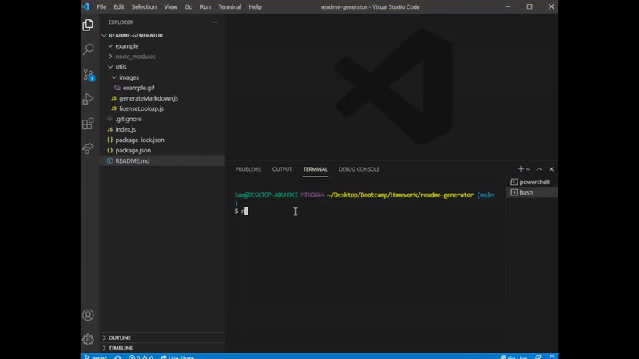

# README Generator

## Description

A command-line application that allows the user to dynamically create a professional README.md for their project. This allows the user to spend more time working on their project, instead of developing a README file!

[GitHub Repo](https://github.com/spreston4/readme-generator)

[Example: Generated README](./example/gen-README.md)



## Technologies used

Built in visual Studio with:
* Node.js
* JavaScript / jQuery
* GitHub API

## How to

From the terminal, run the following command:
```bash
node index.js
```

Answer the command-line prompts to build your README file. Once complete, the generated README file is saved in the 'example' folder under the name 'gen-README.md'.

This application utilizes the 'inquirer' package to handle user input, the 'fs' package to write to file, and the 'node-fetch' package to handle API calls.

## User Story

Given the following user story:
```md
AS A developer
I WANT a README generator
SO THAT I can quickly create a professional README for a new project
```


## Acceptance Criteria

Given the following acceptance criteria:
```md
GIVEN a command-line application that accepts user input
WHEN I am prompted for information about my application repository
THEN a high-quality, professional README.md is generated with the title of my project and sections entitled Description, Table of Contents, Installation, Usage, License, Contributing, Tests, and Questions
WHEN I enter my project title
THEN this is displayed as the title of the README
WHEN I enter a description, installation instructions, usage information, contribution guidelines, and test instructions
THEN this information is added to the sections of the README entitled Description, Installation, Usage, Contributing, and Tests
WHEN I choose a license for my application from a list of options
THEN a badge for that license is added near the top of the README and a notice is added to the section of the README entitled License that explains which license the application is covered under
WHEN I enter my GitHub username
THEN this is added to the section of the README entitled Questions, with a link to my GitHub profile
WHEN I enter my email address
THEN this is added to the section of the README entitled Questions, with instructions on how to reach me with additional questions
WHEN I click on the links in the Table of Contents
THEN I am taken to the corresponding section of the README
```

## Known Issues

* License information does not currently render
* License badging does not currently render


## Contact Me

GitHub: [spreston4](https://github.com/spreston4)

E-mail: [sam.preston11@gmail.com](mailto:sam.preston11@gmail.com)